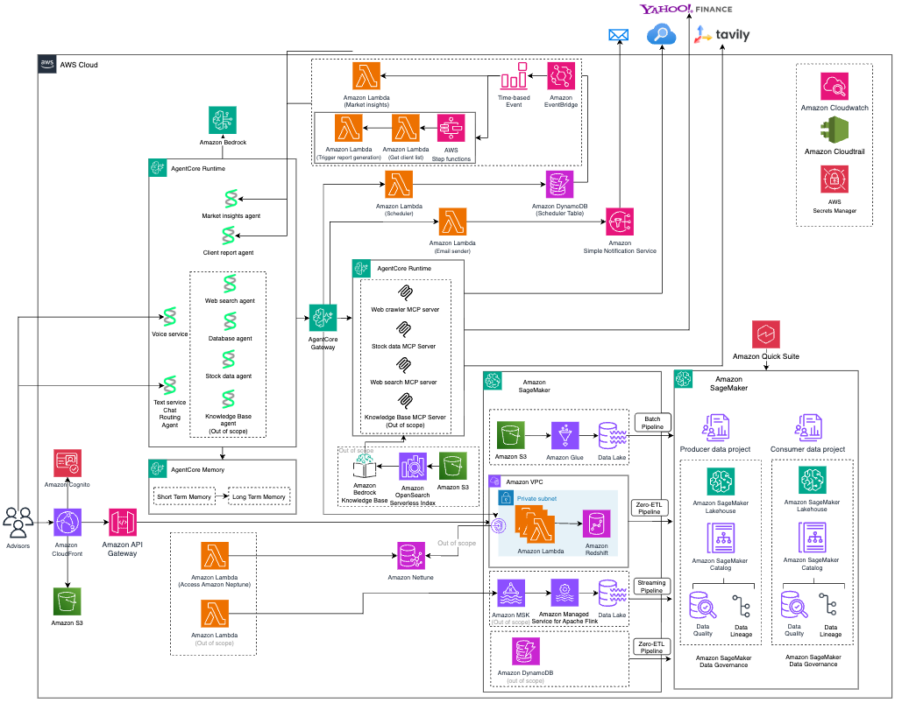

# Wealth Management and Advisor Demo Portal

An innovative advisor platform architected with AWS-native services including AI/ML, graph databases, and modern data lake infrastructure.

## Overview and Key Features

The future of wealth management, featuring:
- 📊 **Market Insights** - Summarize key market themes and events impacting client portfolios
   - AI-powered market intelligence transforms  workflow by automatically crawling financial news, identifying emerging themes using advanced language models on Amazon Bedrock, and delivering personalized insights
   - Advisors receive both general market intelligence and portfolio-specific themes tailored to each client's top holdings, enabling more informed and confident client conversations
   - [Get full details](packages/market_events_coordinator/README.md)


- 🔍 **Client Search** - Intelligent natural language client search using TEXT2SQL technology
    - [Get full details](packages/client_search/README.md)
- 💡 **Advisor Client Intelligence and Deep Analysis** 
   - Graph technology revolutionizes client analysis by modeling complex relationships between advisors, clients, locations, investments, and risk profiles—enabling discovery of hidden insights, effective client segmentation, and identification of cross-sell and up-sell opportunities that traditional keyword or TEXT2SQL searches cannot uncover.
   - Natural language meets deep analytics through the combination of generative AI and graph technology, allowing financial advisors to ask questions conversationally while receiving comprehensive insights
   - [Get full details](packages/graph_search_api/README.md)

- 📋 **Client 365 report** 
   - Automated pre-meeting client briefings covering portfolio performance, market insights, risk analysis, and actionable recommendations
   -  [Get full details](packages/report/README.md)

- 💬 **Smart chat** 
   - Natural language chat interface for portfolio inquiries, market insights, and client reporting with multi-channel communication (text, voice). Additionally, schedule recurring updates to receive the latest information to your email automatically
   - [Get full details for overall chat functions in text and audio](packages/advisor_chat/README.md)
   - [Get full details for scheduler function](packages/scheduler_executor/README.md)
- 📚 **Data Lake** 
   - Unify your financial data with an AWS data lake that powers analytics, BI reporting, and AI applications through a single, governed data foundation for Wealth and Advisor business
   - [Get full details](data-platform/README.md)

## Architecture
Overall architecture for Wealth and Financial Advisor Demo Platform


## Tech Stack & AWS Services

### Frontend

| Technology / Service | Details |
|---|---|
| React | 19.2.4 |
| TypeScript | ~5.9.2 |
| TanStack Router | 1.158.0 |
| TanStack Query | 5.90.20 |
| Recharts | ^3.7.0 |
| Plotly.js | ^3.4.0 |
| Tailwind CSS | 4.1.18 |
| shadcn/ui (new-york style) | via components.json |
| Vite | ^7.0.0 |
| Amazon CloudFront | CDN for React SPA (S3 origin with OAC), SPA routing, access logging |
| Amazon CloudWatch RUM | Real User Monitoring — errors, performance, HTTP telemetries, X-Ray integration |

### Backend

| Technology / Service | Details |
|---|---|
| Python | 3.12.0 |
| FastAPI | 0.128.5 (3 domain-split APIs: Core, Intelligence, Graph Search) |
| Mangum | 0.21.0 |
| AWS Lambda Powertools | 3.24.0 (tracing, logging, metrics) |
| AWS Lambda | 3 FastAPI APIs + dedicated Lambdas for scheduler, reports, themes, email, MCP gateways, MSK data generator, IAM Identity Center, MFA disabler, DataZone connection manager, Snowflake orchestrator. Python 3.12, ARM64. |
| Amazon API Gateway | 3 REST APIs with Cognito authorizer, CORS, throttling (200 burst / 100 rate), X-Ray tracing |

### Database

| Technology / Service | Details |
|---|---|
| Amazon Redshift Serverless | Primary data store — portfolios, holdings, transactions, themes, reports. Analytics views over data lake — advisor dashboards, client portfolios, AUM tracking. QuickSight snapshot tables. COPY from S3. IAM auth + VPC endpoints. |
| Amazon Neptune Analytics | Graph database — client/advisor/company/stock/city relationships via openCypher |
| Amazon DynamoDB | SchedulesTable + ScheduleResultsTable (scheduler feature), Terraform state locking table (data-platform bootstrap) |

### Data Lake

| Technology / Service | Details |
|---|---|
| Terraform | Primary IaC for all data-platform resources (16 deployment modules, separate from CDK app stack) |
| AWS CloudFormation | Bootstrap only — Terraform backend (S3 bucket + DynamoDB lock table + cross-region replication) |
| Amazon S3 Tables | Iceberg table buckets — 24 financial advisor datasets (clients, advisors, accounts, portfolios, securities, transactions, holdings, market_data, performance, fees, goals, interactions, documents, compliance, research, articles, etc.) stored as Apache Iceberg tables |
| Amazon S3 | Data staging buckets (CSV source files), Glue scripts/JARs, Terraform state backend, SageMaker project artifacts, Athena query results, Lambda deployment packages, static website hosting, report storage, CloudFront logs, CDK assets |
| AWS Glue | 24 batch ETL jobs (Glue 5.0, Spark/Python) loading CSV → Iceberg on S3 Tables. Glue Data Catalog (federated S3 Tables catalog), security configurations (KMS encryption), Snowflake connection |
| AWS Lake Formation | Data governance — admin roles, S3 Tables catalog registration, fine-grained permissions (catalog/database/table level) for Admin, Producer, Consumer, QuickSight roles |
| Amazon Athena | Interactive query engine — dedicated workgroup with KMS-encrypted results, querying Iceberg tables via Glue Data Catalog |
| Amazon QuickSight | Enterprise edition — VPC connection to Redshift, 4 datasets (advisor dashboard summary, RUM page views/errors/performance), dashboards (advisor overview with AUM charts, client metrics, RUM analytics) |
| AWS Glue Connection (Snowflake) | Federated connection to Snowflake via SageMaker Lakehouse — credentials in Secrets Manager, Athena spill bucket, VPC-attached |

### AI/ML

| Technology / Service | Details |
|---|---|
| Amazon Bedrock | Claude Sonnet — chat, Cypher generation, reports, themes, client search (InvokeModel, streaming). Model governance project within SageMaker domain. |
| Amazon Bedrock AgentCore | 8 agents (routing, database, stock-data, web-search, graph-search, client-search, report, voice-gateway) + 5 MCP gateways + memory/session management |
| Amazon Nova Sonic | Bidirectional audio streaming voice gateway via WebSocket |
| Amazon SageMaker Unified Studio | Domain ("Corporate") with IAM Identity Center SSO, two projects (Producer + Consumer), Lakehouse integration for querying data lakes via Athena and Redshift |
| Amazon DataZone | Data governance and data mesh — domain, projects, environment blueprints, data sources (S3 Tables + Redshift), business glossary (12+ financial terms), data quality, data lineage |
| Amazon Q | Enabled within the DataZone/SageMaker domain (SSM parameters for Q enablement and IAM auth mode) |
| Strands Agents | ≥1.25.0 (advisor_chat: ≥1.30.0 with a2a,bidi) |
| MCP SDK | 1.26.0 |
| boto3 | 1.42.44 |

### Streaming

| Technology / Service | Details |
|---|---|
| Amazon MSK Serverless | Kafka cluster for real-time financial data streaming — topics: intraday-source-topic, intraday-sink-topic, trade-topic. Lambda data generator every 15 min. EC2 client instance (t3.large) for topic management. |

### Orchestration

| Technology / Service | Details |
|---|---|
| Amazon EventBridge Scheduler | Cron schedules — daily reports (2 AM UTC), daily themes (2 AM UTC), plus dynamic user schedules |
| Amazon EventBridge | Scheduled rule triggering MSK data generator Lambda every 15 minutes (stocks + trade data) |
| AWS Step Functions | 2 state machines: ReportScheduler + ThemeGenerator |
| Amazon SES | Email delivery for scheduled reports and notifications |
| Amazon SNS | Dead letter queue topic for DataZone connection Lambda |

### Networking

| Technology / Service | Details |
|---|---|
| Amazon VPC | Multi-region (primary + secondary) with public/private subnets across 3 AZs, VPC peering between regions. Private subnets for Lambda→Redshift, security groups for Lambda/Redshift/VPC endpoints/bastion. |
| VPC Endpoints | Interface: SSM, STS, Redshift, Bedrock AgentCore/Runtime, CloudWatch Logs, SQS, Lambda. Gateway: S3. |
| AWS WAF | CloudFront WebACL — AWSManagedRulesCommonRuleSet + KnownBadInputsRuleSet |
| Amazon EC2 | Bastion host (t4g.nano, AL2023 ARM64) for SSM tunneling to Redshift. MSK client instance (t3.large, AL2023) for Kafka topic management. |

### Security

| Technology / Service | Details |
|---|---|
| Amazon Cognito | User Pool (email/username sign-in), Identity Pool (AgentCore invocation), Resource Server + executor client |
| AWS IAM Identity Center (SSO) | Organization-level and account-level instances, user/group management (Admin, Domain Owner, Project Contributor, Project Owner), MFA automation via Lambda |
| AWS Secrets Manager | Cognito executor client secret, MSK endpoints, Snowflake credentials, Redshift DataZone credentials |
| AWS KMS | Multi-region key management — dedicated keys for S3, EBS, Glue, CloudWatch, Athena, SSM, S3 Tables, Step Functions logs, DynamoDB tables (primary + secondary regions with aliases) |
| AWS IAM | Fine-grained roles for every Lambda, agent, gateway, EventBridge scheduler, bastion, Glue execution, SageMaker domain, Bedrock model, Lake Formation, QuickSight, MSK client |

### Monitoring

| Technology / Service | Details |
|---|---|
| Amazon CloudWatch Logs | Lambda logs, Step Functions execution logs, Glue job logs, MSK logs (KMS-encrypted) |
| AWS X-Ray | Distributed tracing on all API Gateway deployments and Lambda functions |
| AWS SSM | Port forwarding (bastion → Redshift), Parameter Store (VPC IDs, subnet IDs, security groups, SageMaker/MSK/Identity Center config — all KMS-encrypted SecureString), inventory collection, patching, compliance reporting |
| AWS Service Quotas | Utility scripts for EIP and VPC quota increase requests |

### Build & Tooling

| Technology / Service | Details |
|---|---|
| Nx | 22.6.1 |
| pnpm | workspace (pnpm-lock.yaml) |
| UV | Python package manager |
| AWS CDK | 2.1104.0 / aws-cdk-lib 2.237.1 |
| Vitest | ^4.0.8 |
| Ruff | ≥0.8.2 |
| ESLint | ^9.8.0 |
| Prettier | 3.8.1 |
| Husky | ^9.1.7 |

## Projects

| Project | Path | Description |
|---------|------|-------------|
| `@wealth-management-portal/ui` | `packages/ui` | React website with Cognito auth, Tailwind, and shadcn |
| `wealth_management_portal.api` | `packages/api` | Core FastAPI — dashboard, clients, holdings, transactions, aum, asset-allocation, reports, top-clients, client-search, portfolio-themes (Cognito + REST API Gateway) |
| `wealth_management_portal.intelligence_api` | `packages/intelligence_api` | Intelligence FastAPI — chat, advisor-chat, chart, client-search (Cognito + REST API Gateway) |
| `wealth_management_portal.graph_search_api` | `packages/graph_search_api` | Graph Search FastAPI — Neptune Analytics graph and NL search endpoints (Cognito + REST API Gateway) |
| `wealth_management_portal.advisor_chat` | `packages/advisor_chat` | A2A multi-agent advisor chat system (routing, database, stock-data, market-insights, web-search, client-report, knowledge-base agents + voice gateway) |
| `wealth_management_portal.graph_search_engine` | `packages/graph_search_engine` | Neptune Analytics graph search engine (core logic used by graph_search_api) |
| `wealth_management_portal.neptune_analytics_core` | `packages/neptune_analytics_core` | Neptune Analytics core client and utilities |
| `wealth_management_portal.neptune_analytics_server` | `packages/neptune_analytics_server` | Neptune Analytics MCP server |
| `wealth_management_portal.graph_search` | `packages/graph_search` | Stub module (deprecated — superseded by graph_search_api and graph_search_engine) |
| `wealth_management_portal.market_events_coordinator` | `packages/market_events_coordinator` | Market events AI agent coordinator |
| `wealth_management_portal.market_intelligence_chat` | `packages/market_intelligence_chat` | Market intelligence chat agent (used by Intelligence API for chat) |
| `wealth_management_portal.portfolio_data_access` | `packages/portfolio_data_access` | Redshift data access layer (models + repositories) |
| `wealth_management_portal.portfolio_data_server` | `packages/portfolio_data_server` | Portfolio data MCP server |
| `wealth_management_portal.client_search` | `packages/client_search` | Client search module |
| `wealth_management_portal.redshift_data_access` | `packages/redshift_data_access` | Low-level Redshift data access utilities |
| `wealth_management_portal.common_auth` | `packages/common_auth` | Shared authentication utilities |
| `wealth_management_portal.common_market_events` | `packages/common_market_events` | Shared market events models and Redshift client |
| `wealth_management_portal.email_sender_mcp` | `packages/email_sender_mcp` | Email sender MCP server (SES) |
| `wealth_management_portal.scheduler_mcp` | `packages/scheduler_mcp` | Scheduler MCP server (EventBridge-backed) |
| `wealth_management_portal.scheduler_executor` | `packages/scheduler_executor` | Scheduler executor Lambda functions |
| `wealth_management_portal.scheduler_tools` | `packages/scheduler-tools/scheduler_tools` | Lambda tools for scheduled report and client-list generation |
| `wealth_management_portal.report` | `packages/report` | Python reporting module |
| `wealth_management_portal.web_crawler` | `packages/web_crawler` | Web crawler MCP module |
| `@wealth-management-portal/infra` | `packages/infra` | CDK infrastructure |
| `@wealth-management-portal/ci-infra` | `packages/ci-infra` | CI/CD CDK infrastructure |
| `@wealth-management-portal/common-constructs` | `packages/common/constructs` | Shared CDK constructs |
| `@wealth-management-portal/common-shadcn` | `packages/common/shadcn` | Shared shadcn UI components |

## Folder Structure

```
packages/
├── ui/                      # React frontend (Tailwind + shadcn)
│   ├── src/
│   │   ├── components/      # App layout, auth, API providers
│   │   ├── hooks/           # API hooks, runtime config
│   │   ├── routes/          # TanStack Router pages
│   │   └── generated/       # Auto-generated type-safe API client
│   └── public/
├── api/                     # Core FastAPI — dashboard, clients, holdings, transactions
│   ├── wealth_management_portal_api/
│   │   ├── __init__.py      # App setup, Powertools middleware
│   │   └── main.py          # API routes
│   ├── tests/
│   └── scripts/             # OpenAPI spec generation
├── intelligence_api/        # Intelligence FastAPI — chat, advisor-chat, chart, client-search
│   ├── wealth_management_portal_intelligence_api/
│   │   ├── __init__.py      # App setup, Powertools middleware
│   │   └── main.py          # API routes
│   ├── tests/
│   └── scripts/             # OpenAPI spec generation
├── graph_search_api/        # Graph Search FastAPI — Neptune Analytics endpoints
│   ├── wealth_management_portal_graph_search_api/
│   │   ├── __init__.py      # App setup, Powertools middleware
│   │   └── main.py          # API routes
│   ├── tests/
│   └── scripts/             # OpenAPI spec generation
├── graph_search/            # Stub module (deprecated — see graph_search_api / graph_search_engine)
│   ├── wealth_management_portal_graph_search/
│   │   └── hello.py
│   └── tests/
├── graph_search_engine/     # Neptune Analytics graph search engine (core logic)
│   └── ...
├── advisor_chat/            # A2A multi-agent advisor chat system
│   ├── wealth_management_portal_advisor_chat/
│   │   ├── routing_agent/   # AgentCore routing agent
│   │   ├── database_agent/  # Redshift query agent
│   │   ├── stock_data_agent/
│   │   ├── market_insights_agent/
│   │   ├── web_search_agent/
│   │   ├── client_report_agent/
│   │   ├── knowledge_base_agent/
│   │   ├── voice_gateway/   # Nova Sonic voice gateway
│   │   └── common/
│   └── tests/
├── market_events_coordinator/ # Market events AI agent coordinator
│   ├── wealth_management_portal_market_events_coordinator/
│   │   ├── theme_processor.py
│   │   └── market_events_coordinator_agent/
│   │       ├── agent.py     # Agent logic
│   │       ├── init.py      # App setup
│   │       └── main.py      # Entry point
│   └── tests/
├── portfolio_data_access/   # Redshift data access layer (models + repositories)
│   ├── wealth_management_portal_portfolio_data_access/
│   │   ├── models/          # SQLAlchemy/Pydantic models (client, portfolio, etc.)
│   │   ├── repositories/    # Data access repositories (portfolio, performance, etc.)
│   │   ├── engine.py        # DB engine configuration
│   │   └── loader.py        # Data loader utilities
│   └── tests/
│       ├── unit/
│       └── integration/
├── report/                  # Python reporting module
│   ├── wealth_management_portal_report/
│   └── tests/
├── web_crawler/             # Web crawler MCP module
│   ├── wealth_management_portal_web_crawler/
│   │   └── web_crawler_mcp/
│   └── tests/
├── infra/                   # CDK application
│   └── src/
│       ├── main.ts          # CDK app entry point
│       ├── stacks/          # CloudFormation stacks
│       └── stages/          # Deployment stages
└── common/
    ├── constructs/          # Shared CDK constructs (API, website, identity)
    │   └── src/
    │       ├── app/         # App-specific constructs
    │       │   ├── apis/            # API Gateway constructs (api, intelligence-api, graph-search-api)
    │       │   ├── agents/          # AgentCore agent constructs
    │       │   ├── lambda-functions/ # Lambda function constructs
    │       │   ├── mcp-servers/     # MCP server constructs
    │       │   ├── gateway/         # HTTP gateway constructs
    │       │   ├── step-functions/  # Step Functions state machines
    │       │   ├── dynamodb/        # DynamoDB table constructs
    │       │   └── static-websites/ # CloudFront + S3 website constructs
    │       └── core/        # Reusable constructs (auth, runtime config)
    └── shadcn/              # Shared shadcn UI components
        └── src/

data/                        # Local sample data & Redshift migration scripts
├── clients/                 # Sample client JSON data (chen/, gray/)
├── products/                # Product catalog JSON
├── redshift-migration/      # DDL, DML, and migration runner scripts
└── redshift_schema.md       # Redshift schema documentation

data-platform/               # Redshift data platform (IaC, DDL, docs)
├── iac/                     # Infrastructure-as-code for data platform
├── ddl-redshift/            # Redshift DDL scripts
├── data/                    # Seed / reference data
├── docs/                    # Data platform documentation
├── glossary/                # Data glossary
├── build-script/            # Build and deployment scripts
├── init.sh                  # Platform initialisation script
├── set-env-vars.sh          # Environment variable setup
├── Makefile                 # Build targets
└── README.md

scripts/                     # Utility and test scripts
├── setup.mjs                # Interactive .env generator (pnpm nx setup)
├── start-agents.sh          # Start A2A agent processes locally
├── allow-redshift-access.sh # Add Redshift security group ingress rules
├── ssm-tunnel.mjs           # SSM bastion tunnel helper
├── chat-cli.py              # CLI for testing the chat API
├── deploy-report-views.sh   # Deploy Redshift report views
└── ...                      # Additional test and utility scripts
```

## Getting Started

### Prerequisites

- [Git](https://git-scm.com/book/en/v2/Getting-Started-Installing-Git)
- [Node >= 22](https://nodejs.org/en/download) (we recommend [NVM](https://github.com/nvm-sh/nvm) for managing versions)
- [PNPM >= 10](https://pnpm.io/installation#using-npm)
- [AWS CLI v2](https://docs.aws.amazon.com/cli/latest/userguide/getting-started-install.html) configured with credentials
- [Amazon Bedrock model access](https://console.aws.amazon.com/bedrock/home#/modelaccess) — enable the following models in your deployment region:
  - Anthropic Claude Sonnet 4.5 (`us.anthropic.claude-sonnet-4-5-20250929-v1:0`)
  - Anthropic Claude Haiku 4.5 (`us.anthropic.claude-haiku-4-5-20251001-v1:0`)
  - Amazon Nova Sonic (`amazon.nova-2-sonic-v1:0`)
- Create Tavily API key (optional): Visit [Tavily](https://www.tavily.com/) and create an API key. Required for the web search and market insights features in the smart chat

### Deployment
<div style="background-color: #cee8f6ff; padding: 12px; border-left: 4px solid #3407ffff; color: #000000;">
⚠️ A full deployment requires AdministratorAccess permissions on your AWS CLI account.
</div>

Two CodeBuild projects automate the full deployment. A developer can go from a fresh AWS account to a running application with minimal manual intervention.

#### **Step 1**: Configure SSM Parameters

```bash
./scripts/setup-ssm-params.sh
```

The script prompts for app name, env name, regions, and other settings — with smart defaults for each. It also creates the `Admin` IAM role for Lake Formation if it doesn't exist.

#### **Step 2**: Deploy CI Infrastructure

```bash
pnpm install
pnpm nx build @wealth-management-portal/ci-infra
pnpm nx bootstrap @wealth-management-portal/ci-infra # first time only
pnpm nx deploy @wealth-management-portal/ci-infra
```

This creates two CodeBuild projects: `wealth-mgmt-platform-deploy` (data platform) and `wealth-mgmt-deploy` (application).

#### **Step 3**: Upload Source and Deploy Data Platform

```bash
./scripts/upload-source.sh
./scripts/trigger-build.sh wealth-mgmt-platform-deploy buildspec-platform.yml
```

Takes ~45 minutes. Deploys VPC, Redshift, Glue data lake, SageMaker, Lake Formation, QuickSight, and all supporting infrastructure.

**After the build completes**, complete the 1 manual step:

1. **Reset IDC passwords** — open [IAM Identity Center console](https://console.aws.amazon.com/singlesignon/home) → Users → Reset password for each created user

> This is the only manual step in the entire deployment. No API exists for IDC password resets.

#### **Step 4**: Deploy Application

```bash
./scripts/trigger-build.sh wealth-mgmt-deploy buildspec-app.yml
```

Takes ~30 minutes. Deploys Lambda functions, API Gateway, Neptune, Cognito, CloudFront, and runs all post-deploy steps (Lake Formation grants, Redshift grants, Neptune data load, test user creation).

#### **Step 5**: Access the Application

Open the CloudFront URL from the Step 4 build output and sign in with the test user credentials. You can also retrieve the URL by running following command on CLI. You are all set and login to the CloudFront URL and explore the solution. 

You can use the ID and password that you added in the Step 1. If you lost it, you can go to AWS Console and reset password.

```bash
aws cloudformation describe-stacks --region ${AWS_REGION:-us-west-2} \
  --stack-name "$(aws cloudformation list-stacks --region ${AWS_REGION:-us-west-2} \
    --stack-status-filter CREATE_COMPLETE UPDATE_COMPLETE \
    --query "StackSummaries[?contains(StackName,'Application')].StackName | [0]" \
    --output text)" \
  --query "Stacks[0].Outputs[?contains(OutputKey,'DomainName')].OutputValue | [0]" \
  --output text
```

#### Re-deploying After Code Changes

```bash
./scripts/upload-source.sh
./scripts/trigger-build.sh wealth-mgmt-deploy buildspec-app.yml
```

Only the application build needs to re-run. Re-run the data platform build only if infrastructure changes.

#### Optional: Enable Scheduled Jobs

The CDK deploys two EventBridge schedules that are **disabled by default**:

| Schedule | Runs | What it does |
|---|---|---|
| `ReportSchedule` | Daily at 2 AM UTC | Generates client reports via Step Functions (Bedrock + Redshift) |
| `ThemeSchedule` | Daily at 2 AM UTC | Crawls financial news and generates market themes (Bedrock + web crawling) |

Enable them in the [EventBridge Scheduler console](https://console.aws.amazon.com/scheduler/home), or run the Step Functions manually from the AWS Console to test.

> ⚠️ These schedules invoke Bedrock models and web crawling on every run, which incurs costs.

### Troubleshooting

- **Re-runs are safe** — both buildspecs are idempotent. Terraform handles drift, CDK skips unchanged resources, and all post-deploy steps are no-ops when nothing changed.
- **Check build logs** — `aws codebuild batch-get-builds --ids <build-id>` or view in the CodeBuild console.
- **Phase 1 timeout** — 4 hours. If a build hangs, stop it and re-trigger. No rollback needed.
- **Phase 2 timeout** — 30 minutes.

If you see **Nx daemon `EPIPE` or `Daemon process terminated`** errors:
- Increase the inotify watch limit:
  ```bash
  sudo sysctl fs.inotify.max_user_watches=524288
  echo 'fs.inotify.max_user_watches=524288' | sudo tee -a /etc/sysctl.conf
  ```

### Manual Deployment (Advanced)

For step-by-step manual deployment without CodeBuild, see the [Solutions Deployment Guide](data-platform/docs/main/solutions-deployment.md) for the data platform and the [Local Development](#local-development) section below for the application.

## Local Development

Run the application locally against deployed AWS resources (Redshift, Cognito, Neptune). Requires a completed deployment (via CodeBuild above or manual).

### Additional Prerequisites

These are needed only for local development, not for CI/CD deployment:

- [UV >= 0.5.29](https://docs.astral.sh/uv/getting-started/installation/) with Python 3.12+ (`uv python install 3.12.0`)
- [Docker](https://www.docker.com/) — required for bundling Lambda functions during local CDK builds
- [Nx Console for VSCode](https://marketplace.visualstudio.com/items?itemName=nrwl.angular-console) (recommended)

### Generate Local Environment

```bash
scripts/generate-env-from-ssm.sh
```

Auto-discovers all configuration from SSM Parameter Store (region, VPC, subnets, Redshift workgroup, etc.) and writes a `.env` file. No arguments needed — reads app/env names from SSM.

To edit later, modify `.env` directly — see `.env.example` for all available options.

### **Step 1**: Load Runtime Config

Download Cognito and API config for local auth (one-time, or after redeployment):

```sh
pnpm nx load:runtime-config @wealth-management-portal/ui
```

### **Step 3**: Grant Local Permissions

Grant Lake Formation and Redshift permissions to your current IAM role (one-time, or after role changes):

```sh
node scripts/grant-lf-permissions.mjs --self
node scripts/grant-redshift-permissions.mjs --self
```

### **Step 3**: Start the Application Locally

Add local Redshift overrides to `.env`:

```
REDSHIFT_HOST=localhost
REDSHIFT_PORT=5439
```

### **Step 4**: Then start everything. It will take ~2 minutes for initial setup and configuration, then http://localhost:4200 will appear for exploring the solution in your local :

```sh
pnpm nx serve-local @wealth-management-portal/ui
```

This runs the UI, all three APIs, all agent processes, and an SSM tunnel to Redshift:

| Service | URL |
|---|---|
| UI | http://localhost:4200 |
| Core API | http://localhost:8000 |
| Intelligence API | http://localhost:8001 |
| Graph Search API | http://localhost:8005 |
| Routing Agent (chat) | http://localhost:9000 |
| Database Agent | http://localhost:9001 |
| Stock Data Agent | http://localhost:9002 |
| Web Search Agent | http://localhost:9004 |
| Voice Gateway | http://localhost:9005 |

> ⚠️ If `REDSHIFT_DATABASE` is wrong in `.env`, all Redshift queries will fail. The data-platform default is `dev`, not `financial-advisor-db`.

### UI-Only Mode

To run only the UI locally (pointing to deployed APIs in AWS):

```sh
pnpm nx serve @wealth-management-portal/ui
```

### Bastion Host (SSM Tunnel to Redshift)

Redshift runs in private subnets. `serve-local` starts the SSM tunnel automatically. On EC2 instances with direct VPC connectivity, comment out `REDSHIFT_HOST` and `REDSHIFT_PORT` in `.env` to connect directly.

## API Endpoints

### Core API (`packages/api`)
- `GET /echo` - Health/echo check
- `GET /dashboard-summary` - Dashboard metrics
- `GET /aum-trends?limit=12` - Monthly AUM trends
- `GET /client-segments` - Client segment distribution
- `GET /clients` - All clients list
- `GET /top-clients` - Top 5 clients by AUM
- `POST /clients/search` - Natural language client search
- `GET /clients/{client_id}` - Client details
- `GET /clients/{client_id}/holdings?limit=20&offset=0` - Portfolio holdings (paginated)
- `GET /clients/{client_id}/transactions?limit=20&offset=0` - Transaction history (paginated)
- `GET /clients/{client_id}/themes?limit=15` - Portfolio-specific themes
- `GET /clients/{client_id}/aum` - Client AUM history
- `GET /clients/{client_id}/asset-allocation` - Client asset allocation
- `GET /clients/{client_id}/report` - Client report status and download
- `GET /market-themes?limit=6` - AI-generated market themes
- `GET /market-themes/{theme_id}/articles` - Theme source articles

### Intelligence API (`packages/intelligence_api`)
- `POST /chat` - AI chat assistant (market intelligence agent)
- `POST /advisor-chat` - A2A advisor chat via AgentCore routing agent
- `GET /chart` - Lightweight chart data from Yahoo Finance
- `POST /client-search` - Natural language client search

### Graph Search API (`packages/graph_search_api`)
- `GET /api/config` - Client-facing graph configuration
- `GET /api/graph` - Full graph data (nodes + edges)
- `POST /api/graph/load` - Load sample data into Neptune
- `POST /api/enrich` - Enrich search results (backfill connections + column explanations)
- `POST /api/nl-search-enriched-stream` - SSE-streamed natural language graph search

## Build & Test

```sh
# Build everything
pnpm nx run-many --target build --all

# Test everything
pnpm nx run-many --target test --all

# Lint and fix everything
pnpm nx run-many --target lint --configuration=fix --all
```

## UI Targets

```sh
# Generate the type-safe API client (auto-runs on build)
pnpm nx generate:api-client @wealth-management-portal/ui

# Auto-regenerate client on API changes
pnpm nx watch-generate:api-client @wealth-management-portal/ui

# Load runtime config from a deployed environment
pnpm nx load:runtime-config @wealth-management-portal/ui
```

## API Targets

```sh
# Generate OpenAPI spec
pnpm nx openapi wealth_management_portal.api

# Add a Python dependency
pnpm nx add wealth_management_portal.api --name <package> --group dev
```

## Report Targets

```sh
# Add a Python dependency
pnpm nx add wealth_management_portal.report --name <package> --group dev

# Format with black
pnpm nx black-format wealth_management_portal.report
```

## Infrastructure Targets

```sh
# Synthesize CloudFormation
pnpm nx synth @wealth-management-portal/infra

# Deploy
pnpm nx deploy @wealth-management-portal/infra

# Destroy
pnpm nx destroy @wealth-management-portal/infra

# Run Checkov security scan
pnpm nx checkov @wealth-management-portal/infra
```

## Generators

Add new projects or capabilities using the [@aws/nx-plugin](https://awslabs.github.io/nx-plugin-for-aws):

```sh
pnpm nx g @aws/nx-plugin:<generator-name>
```

See the [full list of generators](https://awslabs.github.io/nx-plugin-for-aws) or browse [community plugins](https://nx.dev/plugin-registry).

## Useful Links

- [@aws/nx-plugin docs](https://awslabs.github.io/nx-plugin-for-aws/en/get_started/quick-start/)
- [Nx task runner](https://nx.dev/features/run-tasks)
- [Nx on CI](https://nx.dev/ci/intro/ci-with-nx)
- [AWS Redshift Serverless](https://aws.amazon.com/redshift/redshift-serverless/)
- [Amazon Bedrock](https://aws.amazon.com/bedrock/)
