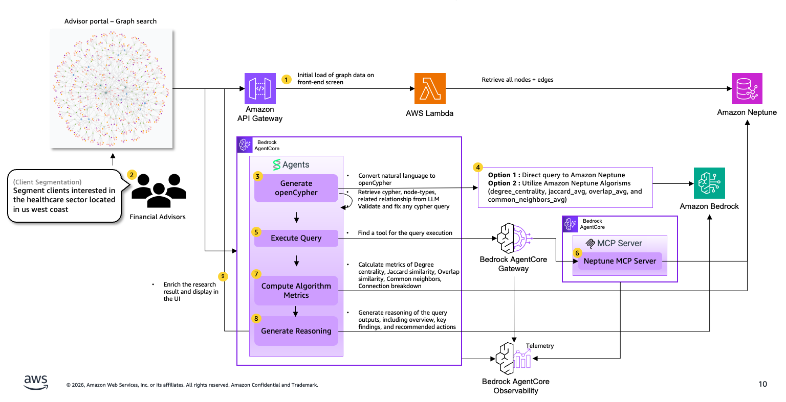

# Graph Search Capability

End-to-end natural language search over a financial knowledge graph powered by Amazon Neptune Analytics, Bedrock LLMs, and Strands Agents.

## Architecture



The graph search capability spans four packages that work together: `graph_search_api` (REST API layer on Lambda), `graph_search_engine` (Strands Agent for NL search on Bedrock AgentCore), `neptune_analytics_core` (shared Neptune client library), and `neptune_analytics_server` (MCP server + Lambda gateway for AgentCore tool routing).

## Packages

### 1. `graph_search_api` — REST API Layer

FastAPI application deployed on AWS Lambda (via Mangum). Serves as the entry point for all client requests.

**Key file:** `wealth_management_portal_graph_search_api/main.py`

**Endpoints:**

| Method | Path | Description |
|--------|------|-------------|
| `GET` | `/api/config` | Returns graph configuration (node types, colors, column strategy, example queries) |
| `GET` | `/api/graph` | Fetches full graph data (nodes + edges) for visualization |
| `POST` | `/api/graph/load` | Loads sample data into Neptune |
| `POST` | `/api/nl-search-enriched-stream` | Main search endpoint — SSE stream with status updates and final enriched result |
| `POST` | `/api/enrich` | Fast enrichment-only (backfill connections + column explanations, no agent call) |

**Infrastructure features:**
- AWS Lambda Powertools (Logger, Metrics, Tracer)
- CORS middleware with configurable allowed origins
- Correlation ID propagation
- Request metrics and cold start tracking

### 2. `graph_search_engine` — NL Search Engine + Agent

Contains the core AI search logic. Deployed as a Strands Agent on Bedrock AgentCore.

**Key files:**
- `neptune_analytics.py` — `NLSearchEngine` class (Cypher generation, query execution, metrics, reasoning)
- `graph_search_agent/agent.py` — `NeptuneMCPQueryClient` (MCP client for AgentCore Gateway)
- `graph_search_agent/main.py` — FastAPI `/invocations` endpoint (AgentCore entry point)

**Capabilities:**
- Natural language → openCypher translation via Strands Agent + Bedrock LLM
- Read-only query validation (blocks CREATE, MERGE, DELETE, etc.)
- Cypher post-processing (fixes `=~` regex to `CONTAINS`, normalizes `~id` to `id()`)
- Batched Neptune algorithm metrics (Jaccard, Overlap, Common Neighbors, Degree Centrality)
- LLM-powered reasoning with streaming token output
- Dual client support: MCP via AgentCore Gateway or direct boto3

### 3. `neptune_analytics_core` — Shared Library

Zero-dependency-on-Strands core library used by all other packages.

**Key files:**
- `client.py` — `NeptuneAnalyticsClient` (boto3 wrapper for Neptune Analytics openCypher queries)
- `enrichment.py` — `SearchResultsEnricher` (node enrichment with related nodes), `compute_connection_breakdown()` (batched connection queries)
- `explainer.py` — `ColumnExplainer` (Bedrock LLM explains column field names)
- `data.py` — Graph data loading (`get_graph_data`, `load_sample_data`, `get_all_nodes`, `get_all_edges`)
- `config.py` — Runtime mode detection (`is_agentcore()`)
- `graph_config.yaml` — Unified configuration (node types, colors, column strategy, virtual columns, example queries)

**Exports:**
`NeptuneAnalyticsClient`, `SearchResultsEnricher`, `ColumnExplainer`, `compute_connection_breakdown`, `get_display_columns`, `get_graph_data`, `load_sample_data`, `sanitize_cypher_ids`, `sanitize_cypher_str`

### 4. `neptune_analytics_server` — MCP Server + Lambda Gateway

Exposes Neptune Analytics operations as tools for Bedrock AgentCore.

**Key files:**
- `neptune_analytics_server/server.py` — FastMCP server with tool definitions
- `lambda_functions/neptune_analytics_gateway.py` — Lambda handler that routes AgentCore Gateway tool calls

**MCP Tools:**

| Tool | Description |
|------|-------------|
| `execute_cypher` | Execute a raw openCypher query |
| `test_connection` | Verify Neptune Analytics connectivity |
| `find_similar_clients` | Find similar clients using Neptune similarity algorithms |
| `compute_degree_centrality` | Compute connection count for a list of node IDs |

## Graph Schema

```
Node Types:
  Advisor    — advisor_id, first_name, last_name
  Client     — client_id, first_name, last_name, portfolio_value, net_worth,
               job_title, return_ytd, return_1_year, return_3_year, return_inception,
               client_since, last_meeting
  Company    — name
  City       — name, state
  Stock      — ticker
  RiskProfile — level (Conservative | Moderate | Aggressive)

Relationships:
  (Advisor)-[:MANAGES]->(Client)
  (Client)-[:WORKS_AT]->(Company)
  (Client)-[:LIVES_IN]->(City)
  (Client)-[:HOLDS]->(Stock)
  (Client)-[:HAS_RISK_PROFILE]->(RiskProfile)
```


## Neptune Algorithm Metrics

The search engine computes four algorithm metrics for matched nodes (batched, not O(n²)):

| Metric | Description | Query Strategy |
|--------|-------------|----------------|
| Degree Centrality | Total connection count per node | Single batched `MATCH (n)-[r]-() ... count(r)` |
| Jaccard Similarity | Neighbor overlap ratio (intersection/union) | Single `neptune.algo.jaccardSimilarity` for all pairs |
| Overlap Similarity | Neighbor overlap ratio (intersection/min) | Single `neptune.algo.overlapSimilarity` for all pairs |
| Common Neighbors | Count of shared neighbors | Single `neptune.algo.neighbors.common` for all pairs |

If Neptune algorithm procedures are unavailable, the engine falls back to manual neighbor-set computation using a batched neighbor fetch.

