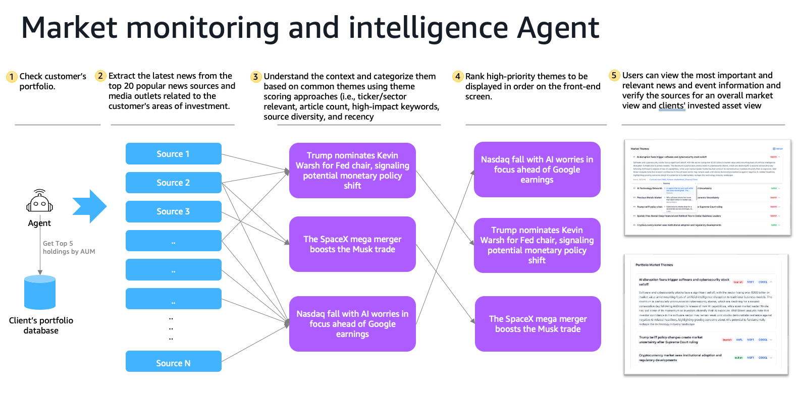

# Market Intelligence Agent 

Strands Agent that coordinates market intelligence — identifying, ranking, and summarizing financial themes from crawled articles using Amazon Bedrock, and serving them via a FastAPI streaming endpoint.



## Architecture

```
FastAPI (/invocations)
    │
    ▼
Strands Agent (system prompt + tools)
    │
    ├──► get_market_themes          ──► Redshift (read-only)
    ├──► get_portfolio_themes       ──► Redshift (read-only)
    └──► current_time
```

The agent receives natural language prompts via `/invocations` and uses its tools to process or retrieve themes. Responses are streamed back as server-sent events.

## Agent Tools

| Tool | Description |
|------|-------------|
| `get_market_themes` | Query pre-generated general market themes from Redshift |
| `get_portfolio_themes` | Query pre-generated portfolio themes for a specific client from Redshift |
| `current_time` | Get current date/time (from `strands_tools`) |

> Theme generation is handled by the `web_crawler` package, which runs on a daily schedule. This agent serves as a query interface for pre-generated themes.

## Theme Processing Pipeline

When generation tools are invoked:

1. Retrieve recent articles from Redshift (configurable lookback window)
2. Identify 5–6 major themes using Bedrock Claude
3. Rank themes by importance score (0–100) based on:
   - Article count (30%), source diversity (25%), recency (25%), keyword impact (20%)
4. Generate professional 2–3 sentence summaries per theme
5. For portfolio themes: evaluate relevance to client holdings (combined score = 40% importance + 60% relevance)
6. Save themes and article associations to Redshift

## Project Structure

```
wealth_management_portal_market_events_coordinator/
├── market_events_coordinator_agent/
│   ├── agent.py       # Strands Agent definition, tool functions, system prompt
│   ├── init.py        # FastAPI app setup (CORS, error handling, OpenAPI)
│   ├── main.py        # /invocations streaming endpoint, /ping health check
│   └── Dockerfile     # ARM64 container image
└── theme_processor.py # ThemeProcessor + PortfolioThemeProcessor (Bedrock + Redshift)
```

## API Endpoints

| Method | Path | Description |
|--------|------|-------------|
| `POST` | `/invocations` | Streaming agent invocation (SSE). Body: `{ "prompt": "...", "session_id": "..." }` |
| `GET` | `/ping` | Health check (returns `HEALTHY`) |

## Running

### Local Development

```bash
pnpm nx market-events-coordinator-agent-serve wealth_management_portal.market_events_coordinator
# Starts on http://localhost:8082
```

### Docker

```bash
pnpm nx market-events-coordinator-agent-docker wealth_management_portal.market_events_coordinator
```

## Environment Variables

| Variable | Required | Description |
|----------|----------|-------------|
| `ALLOWED_ORIGINS` | No | Comma-separated CORS origins (default: `*`) |
| `AWS_REGION` | No | AWS region for Redshift (default: `us-west-2`) |
| `REDSHIFT_WORKGROUP` | Yes | Redshift Serverless workgroup name |
| `REDSHIFT_DATABASE` | Yes | Redshift Serverless database name |

The agent connects to Redshift using the workgroup and database configured via environment variables (see table above). Bedrock calls use cross-region inference.

## Testing

```bash
pnpm nx test wealth_management_portal.market_events_coordinator
```

## Dependencies

- `strands-agents` (1.25.0) — Agent framework with tool orchestration
- `strands-agents-tools` — Built-in tools (`current_time`)
- `bedrock-agentcore` — AgentCore runtime models
- `fastapi` / `uvicorn` — HTTP server
- `boto3` — Bedrock (Claude) and Redshift Data API
- `mcp` (1.26.0) — MCP protocol support
- `wealth_management_portal.common_market_events` — Shared Article/Theme models and Redshift client
- `wealth_management_portal.common_auth` — Shared auth utilities
